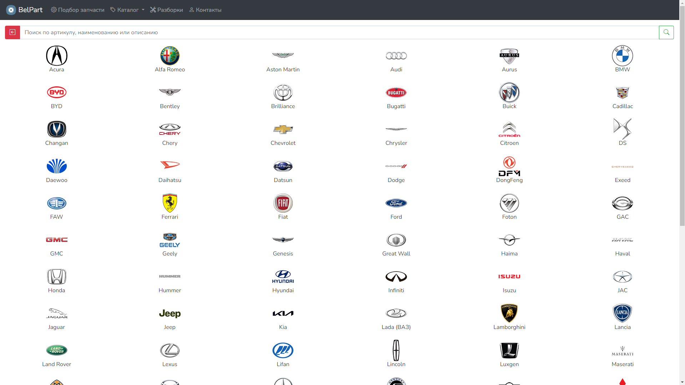
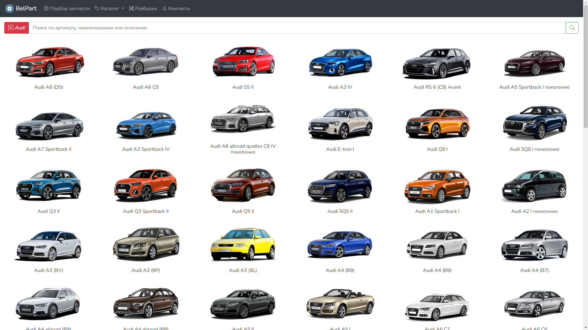
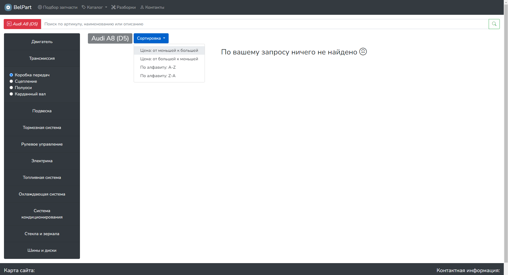
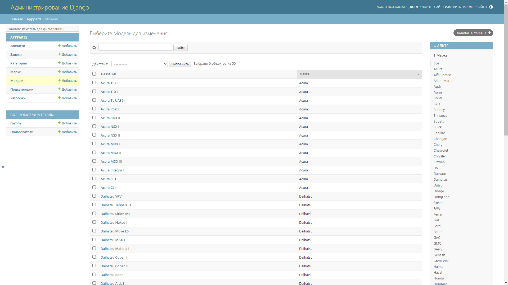

# BelAutoParts

## Web-Приложение по продаже автозапчастей на Django/Bootstrap

## Quick Start
 
1. Клонируйте репозиторий: `git clone https://github.com/xeocean/BelAutoParts.git`
2. Создайте виртуальное окружение: `python -m venv venv`
   - Для Linux/macOS: `source venv/bin/activate`
   - Для Windows: `venv\Scripts\activate`
3. Установите зависимости: `pip install -r requirements.txt `
4. Примените миграции: `python manage.py makemigrations` `python manage.py migrate`
5. (Опционально) Загрузите данные из JSON в базу:` python json_to_db.py`
6. (Опционально) Создайте суперпользователя: `python manage.py createsuperuser`
7. Запустите сервер: `python manage.py runserver`
